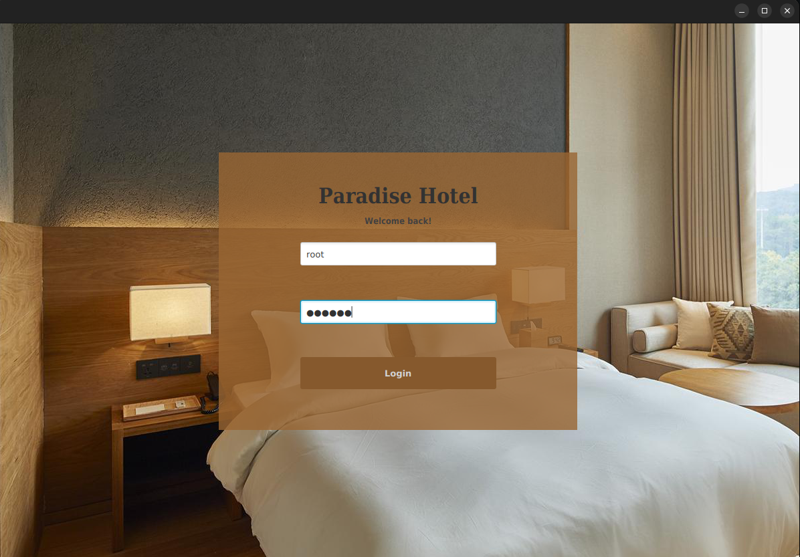
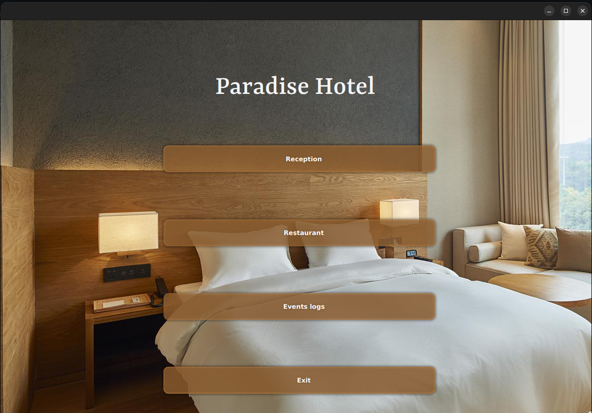
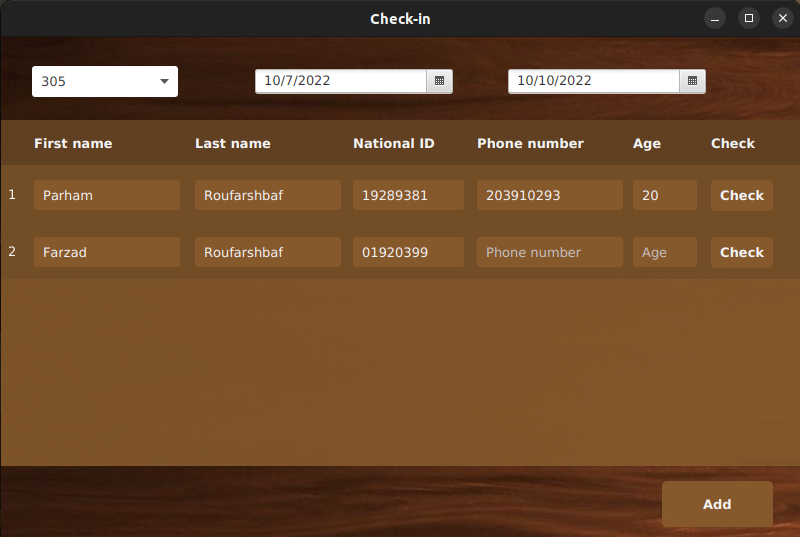
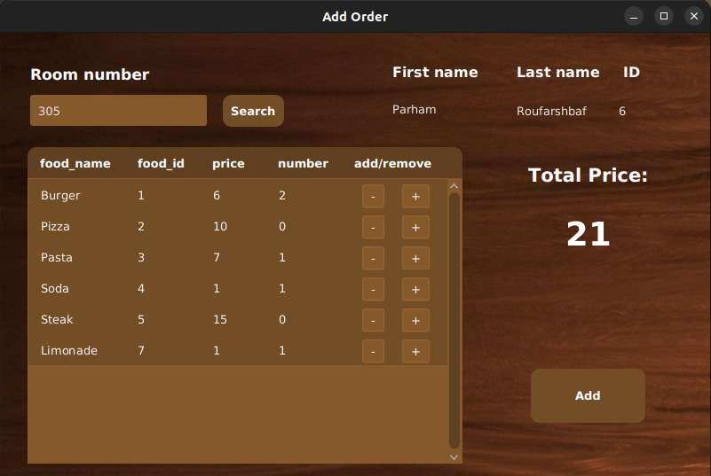
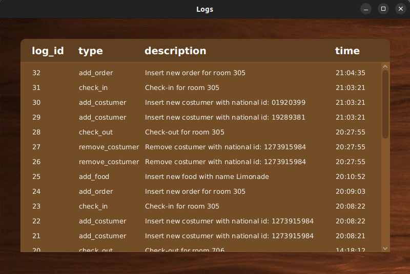

# Hotel-management
This is a simple javafx app which can be used to manage a hotel. It's my first personal and self-ecnourage project. Also, this is my first experience
in working with database and communicate with that using a programming language. 
#### My main goals for doing this project were:
* Learn how to work with a relational database, write queries to gather data from that and get familiar with JDBC driver and how it works with databse.
This was my first motivation after taking this great MySQL course on youtube.
* Recap my knowledge of java and javafx after working with them in my second semester at university.
* Working on how to use git properly to track files and write good commit messages to show the project flow step by step.
# Description
This app consists of two main parts; the reception and the restaurant part. In reception part, you can controll checking-in and checking-out of the costumers. 
In the restaurant part, you can add foods, change details of them, add costumers' orders and check their orders' status and change that. The cost of the orders
will be get added to the residing cost when checking-out. Also, there is a events log part in the app which you can track all the important events in the hotel
such as check-in's, adding orders, etc.
# Technologies used
* Java
* JavaFx
* SceneBuilder
* Css
* MySQL
# Installation
1- Install JRE and SDK and install them.

2- clone the project.

3- Create a database and import tables.sql file to it. If you want to have some initial data, you can use initialize.sql file too.

4- Run App.java file in app package.
# Images

